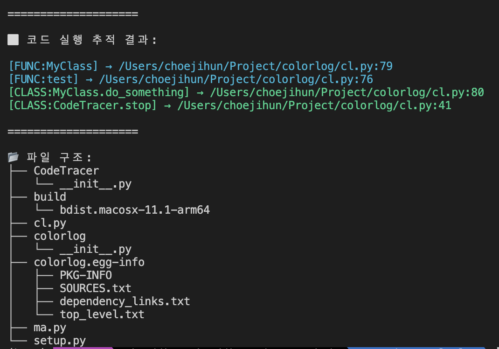

# Code Tracer (코드 추적기)

파이썬 프로그램 실행 중 호출된 함수/클래스를 추적하고, 파일 시스템 구조를 시각적으로 출력할 수 있는 도구입니다.
---
## 설치 방법

```bash
pip install git+https://github.com/choimagon/CodeTracer.git
```
### 지우기
```
pip uninstall CodeTracer
```
---
## 🚀 사용 예시

```python
from your_module import CT  # CT 클래스 정의된 파일 불러오기

ct = CT()
ct.start()  # 추적 시작

# 추적할 코드
def foo():
    print("함수 실행됨")

class Bar:
    def method(self):
        print("클래스 메서드 실행됨")
        foo()

Bar().method()

ct.stop()  # 추적 종료 및 결과 출력
ct.filelist() #현재 폴더 구조 알려줌
```

### 출력 예시 


---
